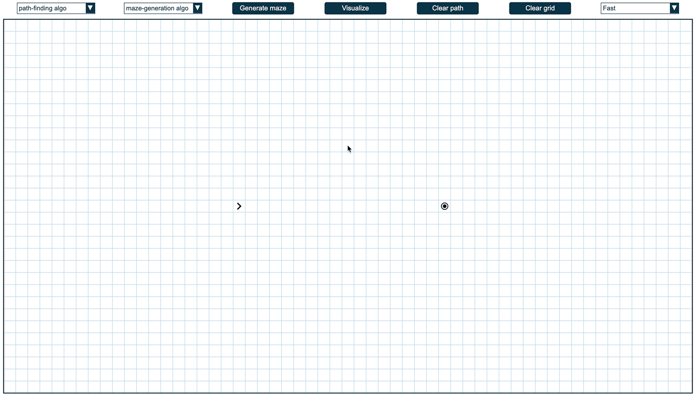
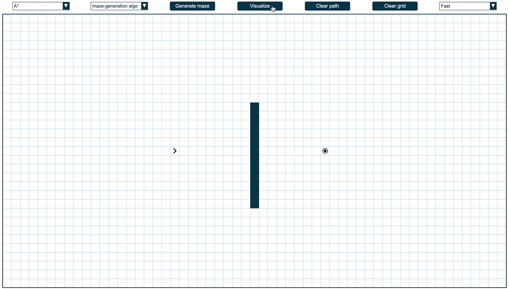
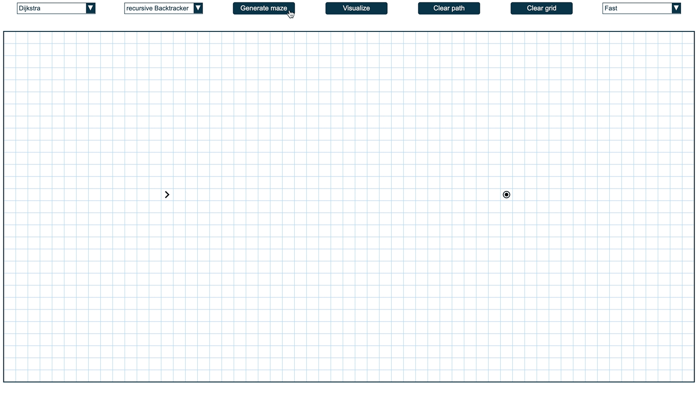

# Pathfinding Visualizer 🧭

**_⚠️Originally developed in Summer 2020⚠️_**

a Vanilla JS application for visualizing pathfinding algorithms and generating mazes featuring:

- 3 pathfinding algorithms:
  - BFS
  - A\*
  - Dijkstra.
- 3 maze generation algorithms
  - Recursive backtracking
  - Eller
  - Kruskal.

TRY IT OUT! 👉 [HERE](https://ah-yussef.github.io/Pathfinding-Visualizer/)

## Demo

#### **1. Add Walls**

#### **2. Pathfinding**

##### **2.1. Dijkstra**

##### **2.2. A\***

#### **3. Maze Generation**

#### **4. Maze Solving**

## License

[MIT](https://choosealicense.com/licenses/mit/)
